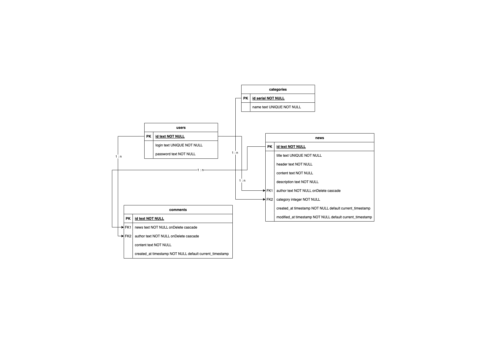

# news-blog

## Features

* REST API
    * CRUD operations on the posts
    * getting / adding / removing the comments
    * getting / adding / validating the users
* Authorization using cookie protection
* Data has kept in database
* Migrations with initial data
* Server side rendering using handlebars
* Github pipelines to unify code style (eslint & stylint) and run unit tests
* Setup unit tests with Jest framework
* Dockerizing the application (including admin panel to db)

## Setup

First copy all `.env.template` files and called them `.env` and fill in necessary variables. Next install all dependencies in `.` and `/migrations` folders using `npm i` command.

### Development

#### Build using Docker

```sh
npm run dev:docker:build
```

#### Start using Docker

```sh
npm run dev:docker
```

## REST API

### News
| Name  | Method | Path | Body |
| ----- | ------ | ---- | ---- |
| getAllNews | GET | /api/news/ | -
| getSingleNews | GET | /api/news/:id | -
| addNews | POST | /api/news/add | title, header, content, description, author
| editNews | PUT | /api/news/edit | id, title, header, content, description, author
| removeNews | DELETE | /api/news/remove/:id | -

### Comments
| Name | Method | Path | Body |
| ---- | ------ | ---- | ---- |
| getComments | GET | /api/comments/:newsId | -
| addComment | POST | /api/comments/add/ | newsId, content, author
| removeComment | DELETE | /api/comments/remove/:id | -

### Users
| Name | Method | Path | Body |
| ---- | ------ | ---- | ---- |
| getAllUsers | GET | /api/users/ | -
| register | POST | /api/users/register | login, password
| login  | POST | /api/users/login | login, password

## Database model

